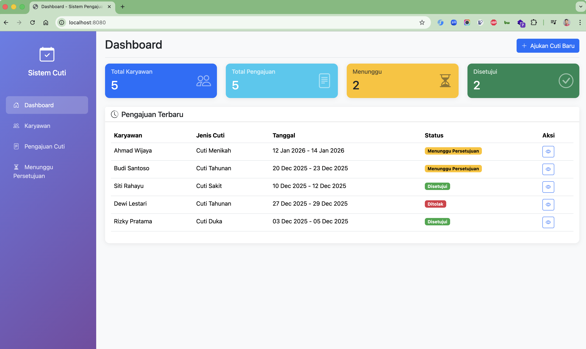
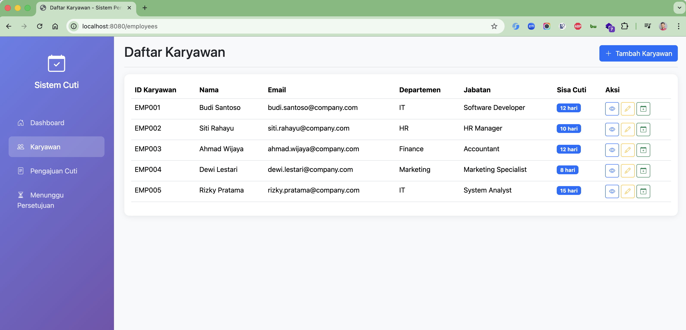
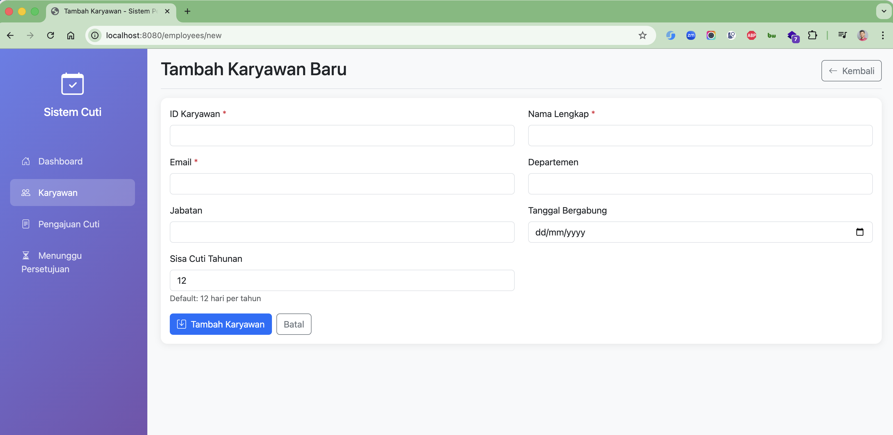
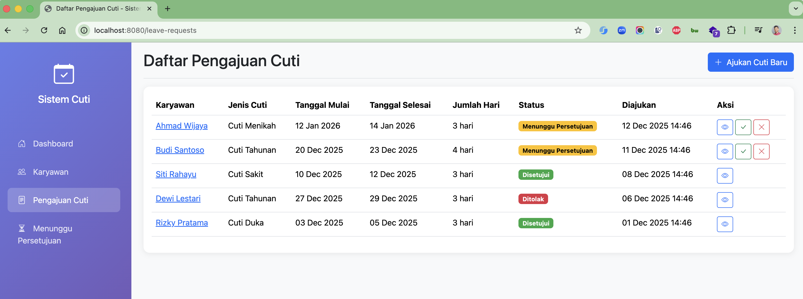
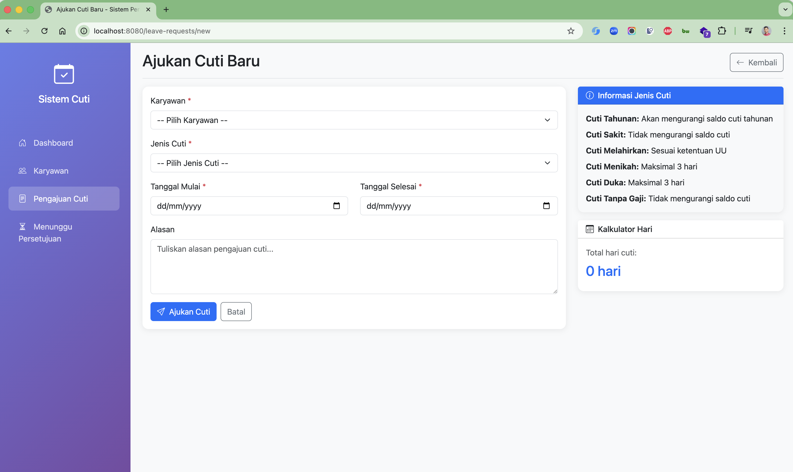
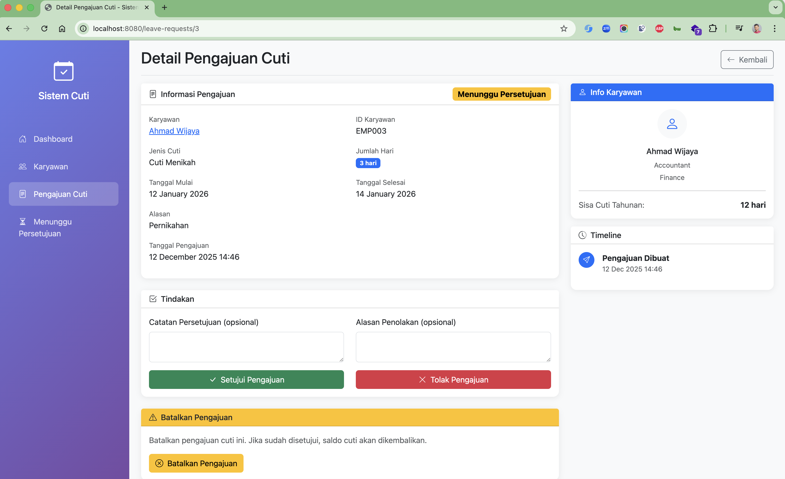
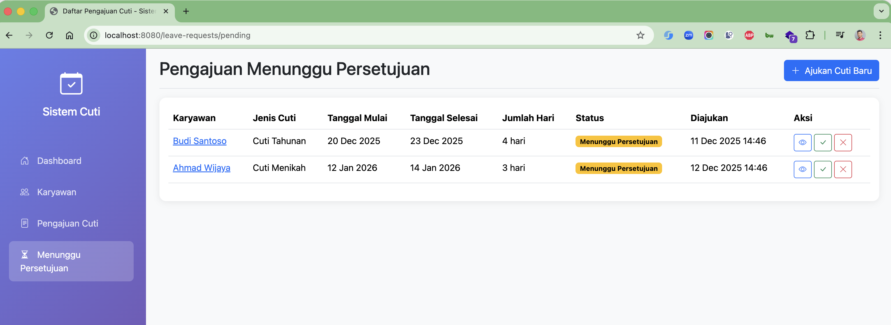

# Cutiaw - Sistem Pengajuan Cuti

Aplikasi web untuk manajemen pengajuan cuti karyawan menggunakan Spring Boot 4, JDK 25, dan MySQL 8.4.

## Tech Stack

- **Backend**: Spring Boot 4.0.0
- **Java**: JDK 25
- **Database**: MySQL 8.4
- **ORM**: Spring Data JPA dengan Hibernate 7.x
- **Template Engine**: Thymeleaf
- **CSS Framework**: Bootstrap 5.3
- **Build Tool**: Maven

## Fitur

- **Dashboard**: Menampilkan statistik karyawan dan pengajuan cuti
- **Manajemen Karyawan**: CRUD data karyawan
- **Pengajuan Cuti**: Membuat, melihat, menyetujui, menolak, dan membatalkan pengajuan cuti
- **Jenis Cuti**: Cuti Tahunan, Sakit, Melahirkan, Paternitas, Menikah, Duka, Tanpa Gaji
- **Validasi**: Pengecekan saldo cuti, overlap tanggal, dll

## Screenshots

### Dashboard


### Daftar Karyawan


### Tambah Karyawan


### Daftar Pengajuan Cuti


### Form Pengajuan Cuti


### Detail Pengajuan Cuti


### Menunggu Persetujuan


## Prasyarat

- JDK 25
- Docker & Docker Compose
- Maven 3.9+

## Cara Menjalankan

### 1. Jalankan Database MySQL

```bash
docker compose up -d
```

MySQL akan berjalan di port 3307 dengan konfigurasi:
- Database: `cutiaw_db`
- Username: `yu71`
- Password: `53cret`

### 2. Jalankan Aplikasi

```bash
./mvnw spring-boot:run
```

### 3. Akses Aplikasi

Buka browser dan akses: http://localhost:8080

## Struktur Project

```
src/main/java/id/my/hendisantika/cutiaw/
├── config/
│   └── DataInitializer.java      # Inisialisasi data sample
├── controller/
│   ├── HomeController.java       # Dashboard
│   ├── EmployeeController.java   # CRUD Karyawan
│   └── LeaveRequestController.java # CRUD Pengajuan Cuti
├── entity/
│   ├── Employee.java             # Entity Karyawan
│   ├── LeaveRequest.java         # Entity Pengajuan Cuti
│   ├── LeaveType.java            # Enum Jenis Cuti
│   └── LeaveStatus.java          # Enum Status Cuti
├── repository/
│   ├── EmployeeRepository.java
│   └── LeaveRequestRepository.java
├── service/
│   ├── EmployeeService.java
│   └── LeaveRequestService.java
└── CutiawApplication.java        # Main class

src/main/resources/
├── templates/
│   ├── fragments/layout.html     # Template layout
│   ├── index.html                # Dashboard
│   ├── employees/                # Template karyawan
│   └── leave-requests/           # Template pengajuan cuti
└── application.properties        # Konfigurasi aplikasi
```

## Sample Data

Aplikasi akan otomatis membuat data sample saat pertama kali dijalankan:
- 5 karyawan dari berbagai departemen
- 5 pengajuan cuti dengan status berbeda

## API Endpoints

### Karyawan
- `GET /employees` - Daftar karyawan
- `GET /employees/new` - Form tambah karyawan
- `POST /employees` - Simpan karyawan baru
- `GET /employees/{id}` - Detail karyawan
- `GET /employees/{id}/edit` - Form edit karyawan
- `POST /employees/{id}` - Update karyawan
- `POST /employees/{id}/delete` - Hapus karyawan

### Pengajuan Cuti
- `GET /leave-requests` - Daftar pengajuan
- `GET /leave-requests/pending` - Daftar menunggu persetujuan
- `GET /leave-requests/new` - Form pengajuan baru
- `POST /leave-requests` - Simpan pengajuan
- `GET /leave-requests/{id}` - Detail pengajuan
- `POST /leave-requests/{id}/approve` - Setujui pengajuan
- `POST /leave-requests/{id}/reject` - Tolak pengajuan
- `POST /leave-requests/{id}/cancel` - Batalkan pengajuan

## Konfigurasi

File `application.properties`:

```properties
# Database
spring.datasource.url=jdbc:mysql://127.0.0.1:3307/cutiaw_db
spring.datasource.username=yu71
spring.datasource.password=53cret

# JPA
spring.jpa.hibernate.ddl-auto=update
spring.jpa.show-sql=true

# Server
server.port=8080
```

## License

MIT License
